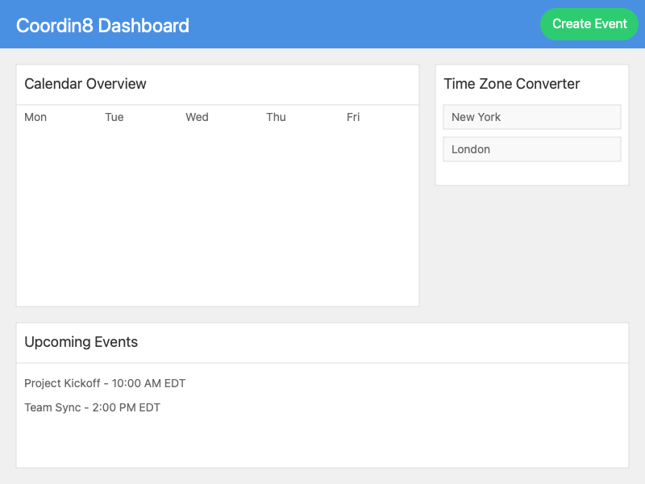
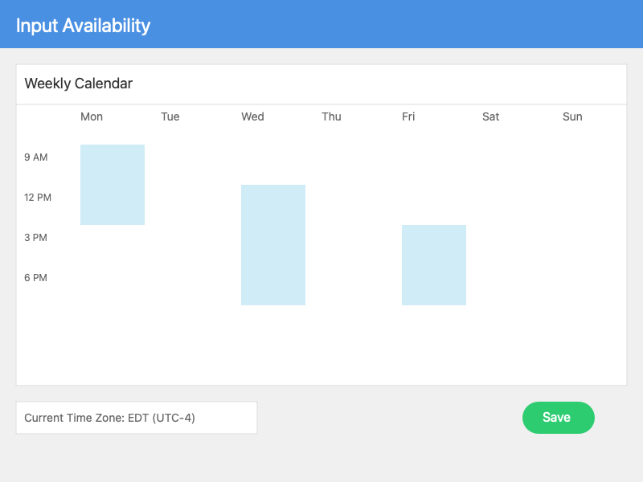
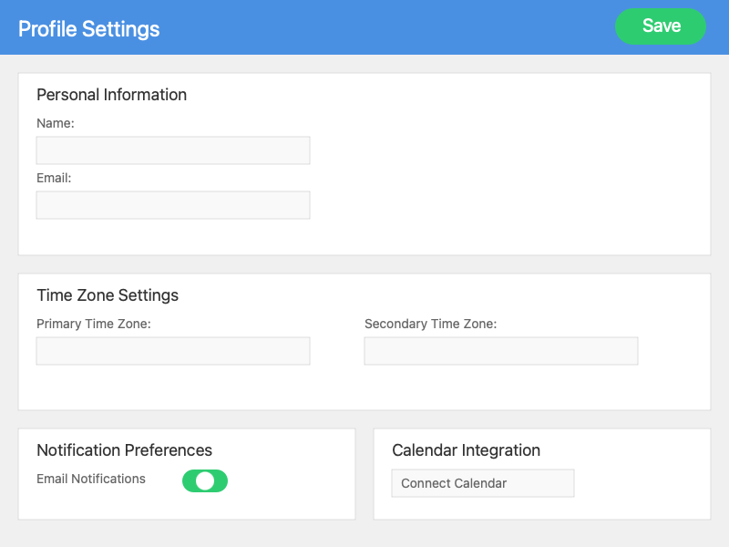

# UI Diagrams

Flow chart for the Coordin8 application 

## Main Dashboard Screen
The Main Dashboard is the central hub of Coordin8, providing users with an overview of their scheduled events and upcoming meetings across different time zones.

Key elements:
1. Calendar Overview: Displays scheduled events, color-coded by time zone.
2. Time Zone Converter: Allows quick conversion between different time zones.
3. Create Event Button: Takes users to the Event Creation Screen.

Use Case: A project manager in New York checks their upcoming meetings with team members in London and Tokyo, quickly identifying which meetings fall outside regular working hours.

## Event Creation Screen
The Event Creation Screen simplifies scheduling meetings across different time zones.

Key features:
1. Event Details Form: For entering event title, description, etc.
2. Time Zone Selection: Dropdown to select the primary event time zone.
3. Participant Invitation: Add participants and view their time zones.
4. Availability Viewer: Shows availability of all invited participants across time zones.

Use Case: A team lead in San Francisco schedules a project kickoff with team members in New York, London, and Sydney, easily finding a time that works for all participants.

## Availability Input Screen
The Availability Input Screen allows users to set their availability or respond to meeting requests.

Key features:
1. Weekly Calendar View: Click-and-drag interface to select available time slots.
2. Time Zone Display: Shows current time zone with option to view in different zones.
3. Recurring Availability: Set repeating availability patterns.
Integration with Personal Calendar: Import availability from external calendars.

Use Case: An employee in Tokyo receives a team meeting invitation and uses this screen to indicate their available time slots, which the system translates for all other participants.

## Profile Settings Screen
The Profile Settings Screen allows users to customize their account preferences and manage their time zone settings.

Key features:
1. Personal Information: Fields to update name, email, and profile picture.
2. Time Zone Settings: Option to set primary time zone and any secondary time zones of interest.
3. Notification Preferences: Controls for email and in-app notifications.
4. Calendar Integration: Options to connect and sync with external calendar services.

Use Case: A freelancer who frequently travels between New York and London uses this screen to add both time zones to their profile, ensuring accurate time displays regardless of their current location.

