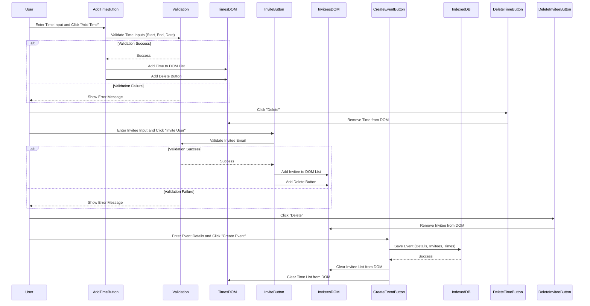

The feature I will focus on here is my Event Creation Feature. This feature allows the user to fill in Event Details input, Invitee input, and Potential Times input. The event details include event name and evet description. Invitee input involves entering the invitee's email and clicking "Add Invitee" button; the email is validated and, on success, will add the invitee to the InteractiveInviteesList, updating the UI. Potential times input involves entering the start time, end time, and date and clicking "Add Time" button; the time inputs are validated and, on success, will add the time/date data to the InteractiveTimesList, updating the UI. The user can then click the "Create Event" button which will publish the NewMeeting and StoreMeeting events, saving the Event Information in IndexedDB.

