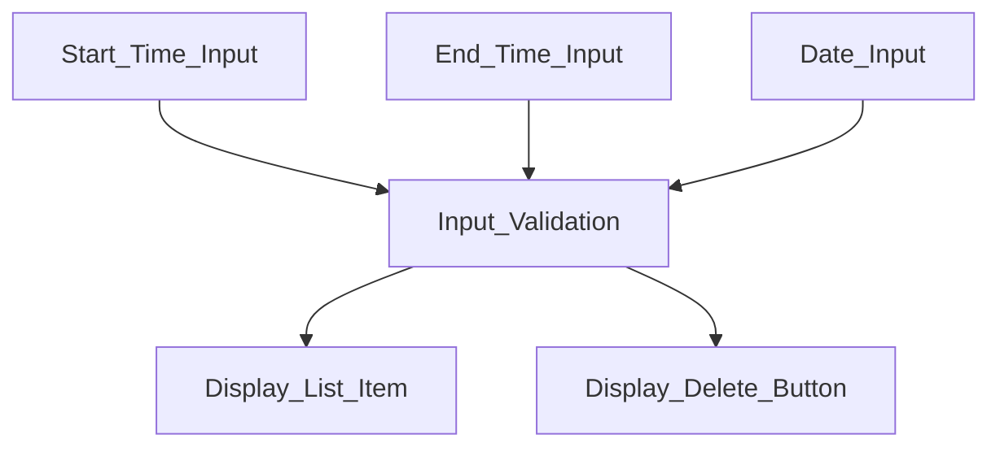

The feature I will focus on here is my InteractiveTimesList. This is a sub-feature to the EventCreationComponent. For this feature, the user will enter in the start time, end time, and date inputs and click the "Add Time" button. This button click will lead to the input being validated to ensure it is in the correct formats (HH:MM for time and YYYY-MM-DD for date). After the time inputs are validated, a new list element will be created and added to the DOM. This will display the potential time/date on the screen. A delete button corresponding to the list item will also be displayed on the DOM. If the user clicks this delete button, the corresponding list item will be removed from the DOM.

