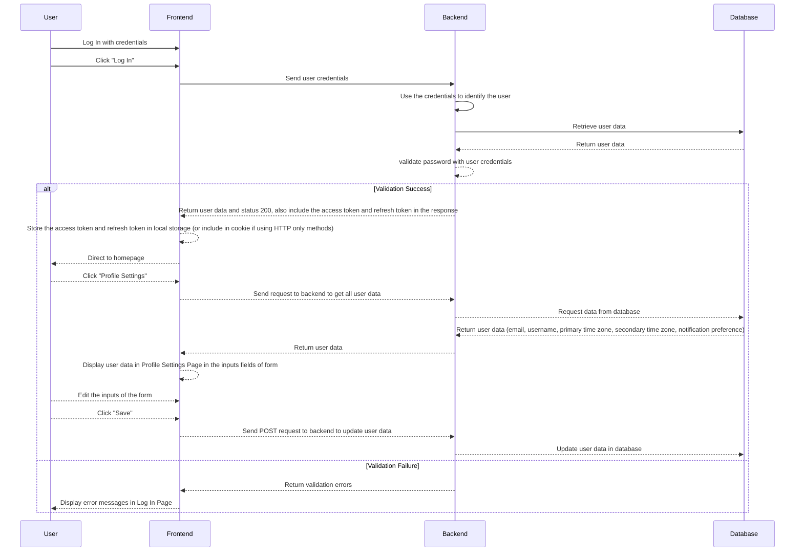

### Profile Settings Feature

The profile settings feature allows users to update their profile information, including their email, username, primary time zone, secondary time zone, and notification preferences. This feature worked depend on authentication (which we just implemented the UI for in this milestone), but my diagram will also include part of the authentication process.

Case 1: User logs in

Case 2: User signs up

```mermaid
sequenceDiagram
    participant User
    participant Frontend
    participant Backend
    participant Database

    User->>Frontend: Sign Up with email and password
    User->>Frontend: Click "Sign Up"
    Frontend->>Backend: Send data
    Backend->>Backend: Use the credentials to identify if the user already exists
    Backend -->> Database: Retrieve user data
    alt If exists:
        Backend-->>Frontend: Return error message and display error message, ask user to login
    else Not exists:
        Backend -->>Backend: called hash function to hash password
        Backend -->> Database: Send request to store new entry with user data in database
        Database -->> Backend: Return user data
        Backend -->> Frontend: Return status 200 and include access token and refresh token in response
        Frontend -->> Frontend: Store the access token and refresh token in local storage (or include in cookie if using HTTP only methods)
        Frontend -->> User: Direct to SetUpAccount Page, shows form to ask user for primary timezone and notification preference
        User -->> Frontend: Fill in the form
        User -->> Frontend: Click "Save"
        Frontend -->> Backend: Send POST request to backend to update user data
        Backend -->> Database: Update user data in database
        Backend -->> Frontend: Return status 200 
        

       Frontend -->> User: Direct to homepage
       User -->> Frontend: Click "Profile Settings"
       Frontend -->> Backend: Send request to backend to get all user data
       Backend -->> Database: Request data from database
       Database -->> Backend: Return user data (email, username, primary time zone, secondary time zone, notification preference)
       Backend -->> Frontend: Return user data
       Frontend -->> Frontend: Display user data in Profile Settings Page in the inputs fields of form 
       User -->> Frontend: Edit the inputs of the form
       User -->> Frontend: Click "Save"
       Frontend -->> Backend: Send POST request to backend to update user data
       Backend -->> Database: Update user data in database
    end
