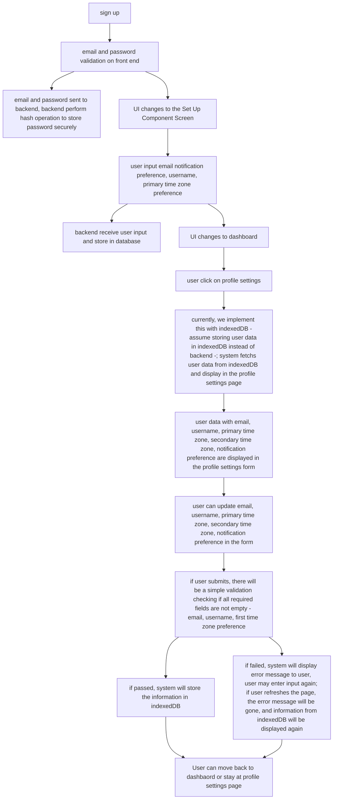

Flow chart for authentication to profile settings page. 

Note: the part I am mainly responsible for is very back-end oriented, so my flow chart will contain certain parts related to back-end, which is not implemented in this milesonte. However, I also contributed to other features of my teammate for this milestone, but since I am not mainly responsible for that, I cannot choose to draw them.

